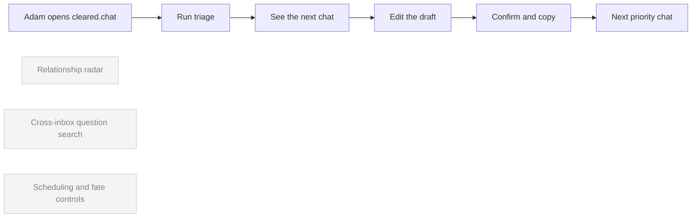

# Simplicity blueprint - the radically simple version of cleared.chat

One sentence: if cleared.chat did exactly one thing perfectly, Adam could open
the top-priority unreplied chat, approve a strong reply, and leave with that
relationship loop ready to close manually.

## The one user

Adam, starting each day with too many cross-network conversations and needing a
fast, trustworthy way to close the next relationship loop.

## The core loop

1. Run triage.
2. Open the highest-priority chat.
3. Read the context and edit the suggested reply.
4. Confirm and copy the exact text, then send it manually in WhatsApp.
5. Move to the next chat.

Done when: Adam can process the next reply without navigating a dashboard or
deciding what to do first.

## The minimum effective feature set

Every line here survived the deletion test: remove it and the core loop breaks.

- Ranked action queue - without it, Adam must decide who to handle first.
- Context and editable draft for the selected chat - without it, Adam cannot make a safe, useful reply.
- Explicit exact-text copy confirmation - without it, the product violates Adam's approval rule.
- Next-chat progression - without it, the daily inbox-zero loop stops after one reply.

## What this deliberately is NOT (the cut list)

- Relationship radar - NOT YET (restore only when it demonstrably produces a better first reply than the ranked queue).
- Cross-inbox question search - NOT YET (restore only when daily triage is reliably completed and users ask for research, not reply help).
- Fate reassignment, calendar blocking, and archive controls in the primary view - NOT YET (restore only after the reply loop is used daily without friction).
- Dashboard counts, 80/20 hero panel, and multiple folders - NEVER (they duplicate the decision the ranked queue already made).
- Autonomous sending - NEVER (it contradicts Adam's explicit approval rule).

## The "if it worked" bar

With a real WhatsApp inbox loaded, Adam can prepare or intentionally skip the
next five priority replies in order without leaving the main workspace.

## Blueprint notes (2026-08-17)

Built from the live Electron UI, `web/public/index.html`, and the existing
importance-times-urgency triage flow. This pass cuts dashboard surfaces so the
interface becomes a single decision and writing workspace.
